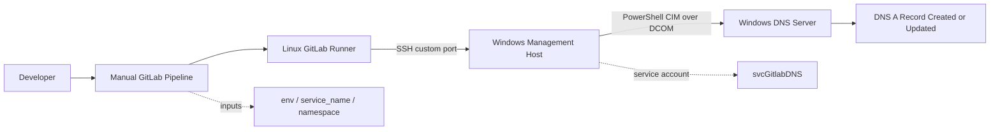

# dns-automation-gitlab-pipeline
Building GitLab-Driven DNS Automation for Windows DNS from a Linux Runner Server

> The workflow allows developers to create or update internal Windows DNS records from a manual GitLab pipeline without giving GitLab direct access to the authoritative DNS server.

---

## 1. Executive Summary

This project implements a controlled DNS automation workflow for internal Windows DNS.

Developers manually start a GitLab pipeline and provide only three values:

- `env`
- `service_name`
- `namespace`

The pipeline generates a DNS A record using the following convention:

```text
<env>.<service-name>.<namespace>.<domain>
```

Example:

```text
dev.test-service.test.domain.local
```

The automation path is intentionally indirect:

```text
GitLab CI/CD Pipeline
  -> Linux GitLab Runner
  -> SSH to Windows Management Host
  -> PowerShell on Management Host
  -> DCOM/CIM Session to Windows DNS Server
  -> Create or Update DNS A Record
```

The important design decision is this: **GitLab does not talk directly to the Windows DNS server**. DNS changes are executed through a controlled Windows management host.

---

## 2. Problem Statement

In many enterprise environments, developers need DNS records for internal applications, ingress endpoints, service routes, or test environments. Manually creating these records causes several operational problems:

- repetitive work for infrastructure teams
- inconsistent naming conventions
- slower delivery for development teams
- higher risk of manual mistakes
- weak traceability when changes are performed outside CI/CD

At the same time, giving GitLab direct access to a domain controller or Windows DNS server is not a good security model.

The goal is to provide DNS self-service while keeping the DNS server protected behind a management boundary.

---

## 3. Final Design

### 3.1 High-Level Flow



### 3.2 Sequence Flow


---

## 4. Why This Architecture Was Chosen

### Option A - Linux Runner -> SSH -> Windows Management Host -> DCOM/CIM -> DNS Server

This is the selected model.

**Pros**

- GitLab Runner remains on Linux.
- No dedicated Windows GitLab Runner is required.
- DNS server is not directly exposed to GitLab.
- Windows DNS operations still happen through native PowerShell DNS cmdlets.
- A management host becomes the controlled administrative boundary.
- Easier to audit and restrict than direct GitLab-to-DNS access.

**Cons**

- Requires OpenSSH configuration on the Windows management host.
- Requires DCOM/CIM access from the management host to the DNS server.
- Requires careful service account permissions.
- DCOM/RPC firewall rules must be understood and tested.

**Validation steps**

```bash
getent hosts MGMT01.domain.local
sudo -u gitlab-runner getent hosts MGMT01.domain.local
sudo -u gitlab-runner ssh-keyscan -T 5 -p 23456 MGMT01.domain.local
```

On the Windows management host:

```powershell
$opt = New-CimSessionOption -Protocol Dcom
$s = New-CimSession -ComputerName DNSSRV01.domain.local -Credential $cred -SessionOption $opt
Get-DnsServerZone -CimSession $s
```

### Option B - Windows GitLab Runner Directly Managing DNS

**Pros**

- Simpler Windows-native execution.
- No SSH hop is needed.
- PowerShell DNS cmdlets can run locally from the runner.

**Cons**

- Requires deploying and maintaining a Windows GitLab Runner.
- Increases exposure of the DNS administration path.
- Runner host becomes more sensitive because it directly performs DNS administration.
- Harder to keep GitLab execution isolated from domain infrastructure.

**Validation steps**

```powershell
Get-DnsServerZone -ComputerName DNSSRV01.domain.local
Get-DnsServerResourceRecord -ZoneName DOMAIN.LOCAL -ComputerName DNSSRV01.domain.local
```

### Option C - Linux Runner -> WinRM -> Windows DNS Server

**Pros**

- Common Ansible pattern for Windows automation.
- Good for many Windows administration tasks.

**Cons**

- Can introduce Kerberos, TrustedHosts, and authentication complexity.
- Remote DNS cmdlet behavior may be less predictable depending on delegation and session context.
- Requires additional WinRM hardening and operational maintenance.

**Validation steps**

```bash
ansible -i inventory.yml windows -m ansible.windows.win_ping
```

```powershell
Test-WSMan DNSSRV01.domain.local
```

**Conclusion:** For this use case, Option A provides the best balance between operational control, simplicity for developers, and protection of the DNS server.

---

## 5. Components

| Component | Responsibility |
|---|---|
| GitLab CI/CD | Manual pipeline UI, input collection, orchestration |
| Linux GitLab Runner | Runs the shell executor and Ansible playbook |
| Ansible | Connects to the Windows management host and runs PowerShell |
| Windows Management Host | SSH entry point and PowerShell execution layer |
| Windows DNS Server | Authoritative DNS server where records are created or updated |
| Service Account | Used for SSH login and DCOM/CIM authentication |

---

## 6. DNS Naming Convention

The pipeline builds DNS names using this format:

```text
<env>.<service-name>.<namespace>.<domain>
```

Example:

```text
dev.test-service.test.domain.local
```

This convention is useful because it keeps records predictable and searchable:

```text
dev.<service>.<namespace>.domain.local
pre.<service>.<namespace>.domain.local
prod.<service>.<namespace>.domain.local
```

Recommended validation rules:

- only lowercase letters, numbers, and hyphens
- no leading hyphen
- no trailing hyphen
- no double hyphen if your internal naming standard forbids it
- environment must be selected from a fixed list

---

## 7. Recommended Repository Structure

```text
dns-automation/
├── README.md
├── .gitlab-ci.yml
├── inventory.yml
├── dns_record_dcom.yml
├── scripts/
│   └── validate-inputs.sh
└── docs/
    ├── windows-management-host.md
    ├── service-account-permissions.md
    └── troubleshooting.md
```

For a small internal repository, keeping everything in the root is acceptable. For a production repository, separating docs, scripts, and playbooks makes maintenance easier.

---

## 8. Ansible Inventory

Create `inventory.yml`:

```yaml
all:
  hosts:
    mgmt-win:
      ansible_host: MGMT01.domain.local
      ansible_connection: ssh
      ansible_shell_type: powershell
      ansible_port: 23456
      ansible_user: "svcGitlabDNS@domain.local"
```

Notes:

- Use UPN format for SSH login: `svcGitlabDNS@domain.local`.
- Use `ansible_shell_type: powershell` because the remote host is Windows.
- The custom SSH port is optional, but it is useful when your organization standardizes administrative SSH on a non-default port.

---

## 9. Ansible Playbook

Create `dns_record_dcom.yml`:

```yaml
---
- name: Create or update DNS record via management host using DCOM
  hosts: mgmt-win
  gather_facts: false
  collections:
    - ansible.windows

  vars:
    zone_name: "DOMAIN.LOCAL"
    dns_server_name: "DNSSRV01.domain.local"
    ttl_seconds: 300
    ingress_ip_map:
      dev: "10.0.0.58"
      pre: "10.0.10.58"
      prod: "10.0.20.58"

  tasks:
    - name: Validate required input
      ansible.builtin.assert:
        that:
          - dns_env is defined
          - dns_service_name is defined
          - dns_namespace is defined
          - dns_admin_user is defined
          - dns_admin_password is defined
          - dns_env in ingress_ip_map
          - dns_namespace is match('^[a-z0-9-]+$')
          - dns_service_name is match('^[a-z0-9-]+$')
          - dns_namespace is not match('(^-|-$|--)')
          - dns_service_name is not match('(^-|-$|--)')
        fail_msg: "Invalid DNS input values. Check DNS_ENV, DNS_SERVICE_NAME, and DNS_NAMESPACE."

    - name: Build computed values
      ansible.builtin.set_fact:
        target_ip: "{{ ingress_ip_map[dns_env] }}"
        record_name: "{{ dns_env }}.{{ dns_service_name }}.{{ dns_namespace }}"
        fqdn: "{{ dns_env }}.{{ dns_service_name }}.{{ dns_namespace }}.domain.local"

    - name: Show computed values
      ansible.builtin.debug:
        msg:
          - "fqdn={{ fqdn }}"
          - "record_name={{ record_name }}"
          - "target_ip={{ target_ip }}"
          - "dns_server={{ dns_server_name }}"
          - "zone={{ zone_name }}"

    - name: Create or update DNS A record through explicit DCOM CIM session
      ansible.windows.win_powershell:
        script: |
          $ErrorActionPreference = 'Stop'

          $securePassword = ConvertTo-SecureString '{{ dns_admin_password }}' -AsPlainText -Force
          $credential = [System.Management.Automation.PSCredential]::new('{{ dns_admin_user }}', $securePassword)

          $sessionOption = New-CimSessionOption -Protocol Dcom
          $session = $null

          try {
              $session = New-CimSession `
                  -ComputerName '{{ dns_server_name }}' `
                  -Credential $credential `
                  -SessionOption $sessionOption

              $existing = Get-DnsServerResourceRecord `
                  -ZoneName '{{ zone_name }}' `
                  -Name '{{ record_name }}' `
                  -RRType 'A' `
                  -CimSession $session `
                  -ErrorAction SilentlyContinue

              if (-not $existing) {
                  Add-DnsServerResourceRecordA `
                      -ZoneName '{{ zone_name }}' `
                      -Name '{{ record_name }}' `
                      -IPv4Address '{{ target_ip }}' `
                      -TimeToLive ([TimeSpan]::FromSeconds({{ ttl_seconds }})) `
                      -CimSession $session

                  @{
                      changed = $true
                      action  = 'created'
                      fqdn    = '{{ fqdn }}'
                      ip      = '{{ target_ip }}'
                  } | ConvertTo-Json -Compress
                  return
              }

              if ($existing -is [array] -and $existing.Count -gt 1) {
                  throw "Multiple A records found for {{ record_name }}. Manual review required."
              }

              $currentIp = $existing.RecordData.IPv4Address.IPAddressToString

              if ($currentIp -eq '{{ target_ip }}') {
                  @{
                      changed = $false
                      action  = 'unchanged'
                      fqdn    = '{{ fqdn }}'
                      ip      = '{{ target_ip }}'
                  } | ConvertTo-Json -Compress
                  return
              }

              $newRecord = $existing.Clone()
              $newRecord.RecordData.IPv4Address = [System.Net.IPAddress]::Parse('{{ target_ip }}')
              $newRecord.TimeToLive = [TimeSpan]::FromSeconds({{ ttl_seconds }})

              Set-DnsServerResourceRecord `
                  -ZoneName '{{ zone_name }}' `
                  -OldInputObject $existing `
                  -NewInputObject $newRecord `
                  -CimSession $session

              @{
                  changed = $true
                  action  = 'updated'
                  fqdn    = '{{ fqdn }}'
                  old_ip  = $currentIp
                  new_ip  = '{{ target_ip }}'
              } | ConvertTo-Json -Compress
          }
          finally {
              if ($session) {
                  $session | Remove-CimSession
              }
          }
      no_log: true
      register: dns_result

    - name: Show DNS operation result
      ansible.builtin.debug:
        var: dns_result.output

    - name: Verify DNS resolution from management host
      ansible.windows.win_powershell:
        script: |
          Resolve-DnsName -Name '{{ fqdn }}' -Server '{{ dns_server_name }}' -ErrorAction Stop |
            Select-Object Name, Type, IPAddress |
            ConvertTo-Json -Compress
      register: dns_verify

    - name: Show DNS verification result
      ansible.builtin.debug:
        var: dns_verify.output
```

### What the playbook does

1. Validates input values.
2. Builds the FQDN.
3. Maps the selected environment to the correct ingress IP.
4. Creates a DCOM CIM session to the DNS server.
5. Checks whether the DNS A record already exists.
6. Creates, updates, or leaves the record unchanged.
7. Verifies DNS resolution directly against the DNS server.

---

## 10. GitLab CI/CD Pipeline

Create `.gitlab-ci.yml`:

```yaml
spec:
  inputs:
    env:
      type: string
      options:
        - dev
        - pre
        - prod
      default: dev
      description: "Target environment for the DNS record"
    service_name:
      type: string
      regex: '^[a-z0-9-]+$'
      description: "Service name, for example test-service"
    namespace:
      type: string
      regex: '^[a-z0-9-]+$'
      description: "Kubernetes namespace, for example test"

---

workflow:
  rules:
    - if: '$CI_PIPELINE_SOURCE == "merge_request_event"'
      when: never
    - if: '$CI_PIPELINE_SOURCE == "push"'
      when: never
    - if: '$CI_PIPELINE_SOURCE == "web"'
      when: always
    - when: never

stages:
  - dns

dns_record_create_or_update:
  stage: dns
  tags:
    - shell
    - infra
  before_script:
    - mkdir -p ~/.ssh
    - chmod 700 ~/.ssh
    - ssh-keyscan -T 5 -p "23456" "MGMT01.domain.local" >> ~/.ssh/known_hosts
    - chmod 600 ~/.ssh/known_hosts
  script:
    - |
      cleanup() {
        rm -f .ci-extra-vars.yml
      }
      trap cleanup EXIT

      cat > .ci-extra-vars.yml <<EOF
      ansible_password: |-
        ${MGMT_SSH_PASSWORD}
      dns_admin_user: |-
        ${DNS_ADMIN_USER}
      dns_admin_password: |-
        ${DNS_ADMIN_PASSWORD}
      dns_env: |-
        $[[ inputs.env ]]
      dns_service_name: |-
        $[[ inputs.service_name ]]
      dns_namespace: |-
        $[[ inputs.namespace ]]
      EOF

      ansible-playbook -i inventory.yml dns_record_dcom.yml -e @.ci-extra-vars.yml
```

### Required GitLab CI/CD variables

| Variable | Purpose | Recommended setting |
|---|---|---|
| `MGMT_SSH_PASSWORD` | Password for SSH login to Windows management host | Masked, protected |
| `DNS_ADMIN_USER` | DCOM/CIM user, for example `DOMAIN\svcGitlabDNS` | Masked or protected |
| `DNS_ADMIN_PASSWORD` | Password for DNS automation service account | Masked, protected |

### Why manual-only pipeline execution is used

The DNS pipeline expects user input. It should not run automatically on every push or merge request.

The workflow rules prevent accidental pipeline execution from:

- push events
- merge request events

Only `web` pipeline runs are allowed.

---

## 11. Windows Management Host Configuration

### 11.1 Enable and validate OpenSSH

Run on the Windows management host as Administrator:

```powershell
Get-Service sshd
Start-Service sshd
Set-Service -Name sshd -StartupType Automatic
```

If OpenSSH Server is not installed:

```powershell
Get-WindowsCapability -Online | Where-Object Name -like 'OpenSSH.Server*'
Add-WindowsCapability -Online -Name OpenSSH.Server~~~~0.0.1.0
```

### 11.2 Configure custom SSH port

Edit:

```text
C:\ProgramData\ssh\sshd_config
```

Set:

```text
Port 23456
```

Restart SSH:

```powershell
Restart-Service sshd
```

Validate listener:

```powershell
Get-NetTCPConnection -State Listen -LocalPort 23456
```

### 11.3 Open Windows Firewall port

```powershell
New-NetFirewallRule `
  -Name "OpenSSH-Server-In-TCP-23456" `
  -DisplayName "OpenSSH Server (sshd) TCP 23456" `
  -Enabled True `
  -Direction Inbound `
  -Protocol TCP `
  -Action Allow `
  -LocalPort 23456
```

---

## 12. Service Account Model

Example service account:

```text
svcGitlabDNS
```

Recommended usage formats:

```text
SSH login:        svcGitlabDNS@domain.local
DCOM/CIM login:  DOMAIN\svcGitlabDNS
```

### Permission principle

The service account should have only the permissions required to create and update DNS records.

Avoid giving broad domain administration privileges.

Recommended controls:

- use a dedicated service account
- restrict access to the required DNS zone only where possible
- avoid record deletion permission unless your change process explicitly requires it
- store credentials only in GitLab masked/protected variables
- limit who can run the manual pipeline
- audit DNS changes on Windows DNS/DC event logs

Important note: membership in `DnsAdmins` can be powerful in Windows environments. If stricter delegation is possible in your organization, prefer record-level or zone-level delegated permissions over broad administrative group membership.

---

## 13. DCOM/CIM Validation from Management Host

Run from the Windows management host:

```powershell
$pw = ConvertTo-SecureString '<PASSWORD>' -AsPlainText -Force
$cred = [System.Management.Automation.PSCredential]::new('DOMAIN\svcGitlabDNS', $pw)

$opt = New-CimSessionOption -Protocol Dcom
$s = New-CimSession `
  -ComputerName DNSSRV01.domain.local `
  -Credential $cred `
  -SessionOption $opt

Get-DnsServerZone -CimSession $s

$s | Remove-CimSession
```

If this works, the management host can authenticate and execute DNS operations through DCOM/CIM.

---

## 14. Linux Runner Validation

Before testing the GitLab pipeline, validate from the runner host itself.

### 14.1 DNS resolution

```bash
getent hosts MGMT01.domain.local
sudo -u gitlab-runner getent hosts MGMT01.domain.local
```

### 14.2 SSH key scan

```bash
sudo -u gitlab-runner ssh-keyscan -T 5 -p 23456 MGMT01.domain.local
```

### 14.3 SSH login test

```bash
sudo -u gitlab-runner ssh -p 23456 'svcGitlabDNS@domain.local'@MGMT01.domain.local
```

### 14.4 Ansible syntax check

```bash
ansible-playbook -i inventory.yml dns_record_dcom.yml --syntax-check
```

### 14.5 Manual Ansible test

```bash
ansible-playbook -i inventory.yml dns_record_dcom.yml \
  -e dns_env=dev \
  -e dns_service_name=test-service \
  -e dns_namespace=test \
  -e dns_admin_user='DOMAIN\svcGitlabDNS' \
  -e dns_admin_password='<PASSWORD>'
```

---

## 15. Operational Behavior

The playbook is idempotent.

| Current DNS state | Action |
|---|---|
| Record does not exist | Create A record |
| Record exists with same IP | No change |
| Record exists with different IP | Update A record |
| Multiple A records exist for the same name | Stop and require manual review |

This behavior is important because DNS automation must not silently overwrite ambiguous records.

---

## 16. Security Review

### Strong points

- GitLab does not directly connect to the DNS server.
- Developers only provide controlled inputs.
- Pipeline runs manually, not on every push.
- Input validation exists in both GitLab and Ansible.
- DNS writes are performed through a service account.
- PowerShell secrets are hidden with `no_log: true` in Ansible.
- DNS verification is included after create/update.

### Risks to watch

| Risk | Why it matters | Mitigation |
|---|---|---|
| Overpowered service account | Could modify more DNS data than intended | Use least privilege delegation where possible |
| Exposed CI variables | DNS credentials could leak | Use masked/protected variables and avoid echoing secrets |
| Persistent temporary files | `.ci-extra-vars.yml` may contain credentials | Remove file with shell trap after playbook execution |
| DCOM/RPC firewall complexity | DCOM may fail even if host resolves | Validate RPC/DCOM path from management host |
| Broad pipeline access | Any user with pipeline access could create DNS records | Restrict manual pipeline execution permissions |
| Multiple A records | Automation may update wrong object | Fail fast and require manual review |

---

## 17. Troubleshooting Matrix

| Symptom | Likely cause | Check | Fix |
|---|---|---|---|
| Runner cannot resolve management host | DNS/search domain issue on runner | `getent hosts MGMT01.domain.local` | Fix runner DNS resolver/search domain |
| Works as root but not as `gitlab-runner` | Different environment or permissions | `sudo -u gitlab-runner getent hosts ...` | Test using the runner user, not root only |
| SSH timeout | Firewall or port mismatch | `ssh-keyscan -p 23456 MGMT01.domain.local` | Open inbound firewall and verify `sshd_config` |
| SSH authentication fails | Wrong username format or password | Try UPN format | Use `svcGitlabDNS@domain.local` for SSH |
| PowerShell DNS cmdlet fails | Missing DNS module or permission issue | `Get-Command Get-DnsServerZone` | Install RSAT DNS tools or fix permissions |
| `New-CimSession` fails | DCOM/RPC blocked or authentication issue | Test from management host | Allow management host to reach DNS server via required Windows management ports |
| Pipeline does not appear for MR/push | Expected behavior | Check `workflow: rules` | Run pipeline manually from GitLab UI |
| Job does not start on expected runner | Missing runner tags | Check runner tags | Ensure runner has `shell` and `infra` tags |
| Record updates but verification fails | DNS replication/cache issue | `Resolve-DnsName -Server DNSSRV01.domain.local` | Verify against authoritative DNS server first |
| Multiple records found | Existing duplicate A records | DNS Manager or PowerShell query | Clean up duplicates manually |

---

## 18. Production Readiness Checklist

### GitLab

- [ ] Pipeline is manual-only.
- [ ] `spec:inputs` validates `env`, `service_name`, and `namespace`.
- [ ] CI/CD variables are masked and protected.
- [ ] Only trusted users can run the pipeline.
- [ ] Runner tags target the correct shell runner.
- [ ] Temporary secret files are removed after execution.

### Linux Runner

- [ ] Ansible is installed.
- [ ] `ansible.windows` collection is installed.
- [ ] Runner user can resolve the management host.
- [ ] Runner user can SSH to the Windows management host.
- [ ] Known hosts are handled predictably.

### Windows Management Host

- [ ] OpenSSH Server is installed and running.
- [ ] Custom SSH port is configured.
- [ ] Firewall allows inbound SSH from the runner.
- [ ] PowerShell can load DNS cmdlets.
- [ ] Management host can create DCOM CIM sessions to DNS server.

### Windows DNS Server

- [ ] DNS zone exists.
- [ ] Service account can create records.
- [ ] Service account can update records.
- [ ] Delete access is not granted unless explicitly required.
- [ ] DNS audit logging is reviewed.

---

## 19. Technical Analysis of the Design

### What is good about the design

The architecture is practical because it separates developer self-service from direct infrastructure access. Developers interact only with GitLab inputs, while DNS operations remain behind the management host.

The design also uses native Windows DNS tooling instead of trying to modify DNS data from Linux directly. This reduces the risk of inconsistent updates and keeps the source of truth inside Windows DNS.

The strongest parts are:

- controlled pipeline inputs
- manual execution
- no direct GitLab-to-DNS connection
- DCOM/CIM session for native DNS cmdlets
- post-change DNS verification
- create/update/unchanged behavior

### What should be improved before broad production use

1. **Use stricter DNS delegation if possible**

   `DnsAdmins` may be too broad for some environments. If the organization supports delegated ACLs on a specific zone or record subtree, prefer that.

2. **Add an approval gate for production**

   For `prod`, require manual approval by infrastructure or platform owners.

3. **Add structured audit output**

   Store the requested FQDN, target IP, GitLab user, pipeline ID, timestamp, and action result as an artifact or audit log.

4. **Add dry-run mode**

   A dry-run mode would show the computed record and planned action without changing DNS.

5. **Add branch/environment protection**

   Prevent non-production branches from creating production DNS records.

6. **Add duplicate record reporting**

   The current behavior correctly fails on multiple A records. A production version should also print enough safe diagnostic data for operators to clean the issue quickly.

---

## 20. Suggested Enhancements

### 20.1 Add production approval

```yaml
dns_record_create_or_update:
  rules:
    - if: '$[[ inputs.env ]] == "prod"'
      when: manual
      allow_failure: false
    - when: on_success
```

### 20.2 Add dry-run input

```yaml
spec:
  inputs:
    dry_run:
      type: boolean
      default: true
      description: "Show planned DNS change without applying it"
```

### 20.3 Add audit artifact

```bash
cat > dns-audit.json <<EOF
{
  "fqdn": "${DNS_FQDN}",
  "environment": "$[[ inputs.env ]]",
  "service_name": "$[[ inputs.service_name ]]",
  "namespace": "$[[ inputs.namespace ]]",
  "pipeline_id": "${CI_PIPELINE_ID}",
  "triggered_by": "${GITLAB_USER_LOGIN}"
}
EOF
```

Then publish it as an artifact.

---

## 21. Example Manual Run

From GitLab UI, run the pipeline with:

| Input | Example value |
|---|---|
| `env` | `dev` |
| `service_name` | `test-service` |
| `namespace` | `test` |


Generated record:

```text
dev.test-service.test.domain.local
```

Expected result:

```text
DNS A record created or updated to the environment ingress IP.
```


---

## 22. Final Notes

This is a good model when the organization wants developer self-service but does not want CI/CD systems to directly access domain controllers or Windows DNS servers.

The core idea is simple:

```text
Expose the request interface to developers.
Keep the execution path controlled by operations.
```

That makes the workflow suitable for internal platform engineering, Kubernetes ingress DNS automation, and controlled enterprise DNS record management.
